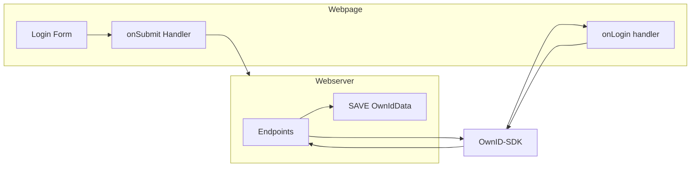

We recommended that you build Login before any other user journey. This page includes instructions for installing the SDK, which is a prerequisite for all other frontend integrations. 


<sup>Figure 1. Login components and dataflow</sup>

## Prerequisites
To get the most out of this guide, make sure you've already completed the backend integrations as described in [Build Server-Side Endpoints](/building-blocks/build-server-endpoints).

## Integrating Login

Integrate account recovery in just three steps. 
1. Step 1 - Install OwnID Web SDK
2. Step 2 - Reference the OwnID SDK
3. Step 3 - Add the Widget to your Login Form


<sup>Figure 2. After implementation (example)</sup>

### Step 1 - Install OwnID Web SDK

The OwnID Web SDK provides communication between your frontend login page and the OwnID cloud server.

If you're using React or Angular frameworks, and you haven't yet installed the OwnID SDK on your local system, you should do that now before continuing.

To install the React-based or the Angular-based SDK, select the tab that matches your framework and copy the npm command shown.

<CodeGroup>
```javascript React
npm install @ownid/react
```

```javascript Angular
npm install @ownid/angular
```
</CodeGroup>

### Step 2 - Reference the OwnID SDK

Reference the SDK at the top of your web pages.

<CodeGroup>

```javascript JavaScript
<script>
    ((o,w,n,i,d)=>{o[i]=o[i]||(async(...a)=>((o[i].q=o[i].q||[]).push(a),{error:null,data:null})),
    (d=w.createElement("script")).src='https://cdn.ownid.com/sdk/'+n,d.async=1,w.head.appendChild(d)})  
    (window,document,'<appID>','ownid');
</script>
```

```jsx React
import { OwnIDInit } from '@ownid/react';

//place this component on the top level of the component hierarchy
//this component doesn't render to any visible UI
ReactDOM.render(
  <React.StrictMode>
      <OwnIDInit
        config={{ appId: config.ownIdAppId }}
      />
      <App />
  </React.StrictMode>,
  document.getElementById("root"),
);
```

```javascript Angular
import { OwnidAngularModule } from '@ownid/angular';

@NgModule({
  imports: [
    OwnidAngularModule.forRoot({appId:'s9d8f7s98f79s87dfMyAppID'}),
  ]})
```
</CodeGroup>
<Note>
**Get the most from OwnID integration**

We recommend including the SDK on all pages, even those without user-facing authentication elements. Doing so will enable users to access additional functionality, wherever they are on your site.
</Note>

### Step 3 - Add the Widget to your Login Form

Place the widget next to the password field by
inserting the script below.

The `data.token` is the value generated by the `getSessionByLoginId` endpoint and you should use it to set a user session or exchange it for a session token. 
<Note>

**Session identifier can be ANY data Object**

Although we're calling it a 'token', the session identifier can be any unique data object. We only pass it right back to you so you're able to associate a callback with a session.
</Note>

<CodeGroup>

```javascript Javascript
<body>
    <form name="myForm">
        <input id="email" type="text" name="email">
        <input id="password" type="text" name="password">
        <input type="submit" value="Submit">
    </form>
    <script>
        ownid("login", {
            loginIdField: document.getElementById("email"),
            passwordField: document.getElementById("password"),
            onError: (error) => console.log(error),
            onLogin: function (data) {
                //Generic example on how to set a session and redirect the user (use your own!)
                //1. set user session using data.token (usually a jwt or session token), generated in your backend and sent through the OwnID server
                localStorage.setItem('sessionID', JSON.stringify({ token: data.token }));
                //2. redirect the user to your entry point 
                window.location.href = '/landingpage';
            }
        });
    </script>
</body>
```

```jsx React
import { OwnID, WidgetType } from '@ownid/react';

...

function LoginComponent() {
    const emailField = useRef(null);
    const passwordField = useRef(null);
    
    function onLogin(data) {
        //Generic example on how to set a session and redirect the user (use your own!)
        //1. set user session using data.token (usually a jwt or session token), generated in your backend and sent through the OwnID server
        localStorage.setItem('sessionID', JSON.stringify({ token: data.token }));
        //2. redirect the user (this is just an example)
        window.location.href = '/account';
    }
    return (
        <form>
            <input ref={emailField} type="email" name="email" />
            <input ref={passwordField} type="password" name="password" />
            <button type="submit">Log In</button>
            <OwnID type={WidgetType.Login}
                passwordField={passwordField}
                loginIdField={emailField}
                onError={(error) => console.error(error)}
                onLogin={onLogin} />
        </form>
    );
}
```

```javascript Angular
<form #myForm="ngForm" (ngSubmit)="onSubmit()">
  <input #emailField type="email">
  <input #passwordField type="password">
  <ownid [type]="WidgetType.Login"
       [loginIdField]="emailField"
       [passwordField]="passwordField"
       (onLogin)="onLogin($event)">
  </ownid>
  <button type="submit">Log In</button>
</form>

onLogin(data) {
  //Generic example on how to set a session and redirect the user (use your own!)
  //1. set user session using data.token (usually a jwt or session token), generated in your backend and sent through the OwnID server
  this.authService.setAuth({ token: data.token });
  //2. redirect the user (this is just an example)
  this.router.navigateByUrl('/account');
}
```
</CodeGroup>


<Check>
**That's it!** 

You've implemented the frontend functionality required for the user to login.

If you're ready to deploy your integration, make sure to read the [Pre-Deployment Checklist](/building-blocks/pre-deployment-checklist) before hand!

</Check>

## Next Steps

### Ready to deploy?

<CardGroup cols={2}>
<Card title="YES!" href="/building-blocks/pre-deployment-checklist" icon="rocket-launch">
 Take me to the Deployment Checklist
</Card>

<Card title="NOT YET..." href="/building-blocks/build-frontend-integration"  icon="screwdriver-wrench">
 I want to build another user journey
</Card>


</CardGroup>


