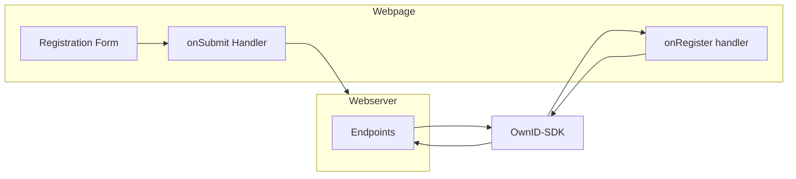

Registration works with your existing form to add new users or enroll new devices for existing users.


<sup>Figure 1. Registration components and dataflow</sup>

## Prerequisites
To get the most out of this guide, make sure to do the following tasks first: 

1. Complete the backend integrations (see [Build Server-Side Endpoints](/building-blocks/build-server-endpoints)).
2. Complete the Login integration (see [Login](/building-blocks/build-login)). 


<sup>Figure 2. After integration (example)</sup>

<Note>
The instructions on this page assume you have already installed and referenced the OwnID SDK as described in Steps 1 and 2 of [Login](/building-blocks/build-login).
</Note>

## Integrating Registration 

Implement the registration form, event handler, and OwnID registration integration on the desired page.

### Add the Widget to your Registration Form

The structure of the registration form and implementation of the onSubmit handler is a vanilla.
The forms in the snippets below are only shown to emphasize the following guidelines. 

#### Registration Form Guidelines

1. Your registration form must contain the fields you want to designate as the _user login id_ and _password_. The snippet below uses 'Email' and 'Password' only as examples.

2. There are no restrictions on the number or name of any other fields you want to include in the form.

3. The name of each Field id is also up to you, provided they're reflected in the submit handler. 

```html HTML
    <form>
        <div><input placeholder="Email" id="email" type="text"></div>
        <div><input placeholder="Name" id="name" type="text"></div>
        <div><input placeholder="Password" id="pass" type="password"></div>
        <div id="confirm-pass-wrapper"><input placeholder="Confirm Password" id="confirm-pass" type="password"></div>
        <button id="submit" onclick="onSubmit();">Register</button>
    </form>
```

#### Implement the SDK 'register' Method

1. In the 'register' method, assign the field you want to designate as the user password to the `passwordField` parameter.

2. In the 'register' method, assign the field you want to designate as the user's login id to the `loginIdField` parameter.

<Note>
The following code snippets arbitrarily use `password` and `email` as password and user login id. You can use any fields you want in those roles by assigning them as noted above.
</Note>

3. In the 'register' method, the `passwordFieldBinding` parameter determines whether the OwnID platform creates a password automatically. The values is `false` by default. If you set it to `true`, OwnID creates a random strong password.

Use the code snippets below to model your implementation of the submit handler and the SDK 'register' method.  

<CodeGroup>

```javascript Javascript
<body>
    <form>
        <div><input placeholder="Email" id="email" type="text"></div>
        <div><input placeholder="Name" id="name" type="text"></div>
        <div><input placeholder="Password" id="pass" type="password"></div>
        <div id="confirm-pass-wrapper"><input placeholder="Confirm Password" id="confirm-pass" type="password"></div>
        <button id="submit" onclick="onSubmit();">Register</button>
    </form>

    <script>
        let ownIdDataObject = null;

        ownid("register", {
            loginIdField: document.getElementById("email"),
            passwordField: document.getElementById("pass"),
            passwordFieldBinding: true, // false by default (if true, OwnID creates a random strong password)
            confirmPasswordContainer: document.querySelector('#confirm-pass-wrapper'), //optional, only if you have a confirm password field (OwnID hides it automatically)
            onError: (error) => console.log(error),
            onRegister: (ownIdData) => {ownIdDataObject = ownIdData;}
        });

        function onSubmit() {
            const regParams = {
                email:  document.querySelector('#email').value,
                name: document.querySelector('#name').value,
                password: document.querySelector('#pass').value,
                ownIdData: ownIdDataObject,
            };
            // this is just an example - Call your existing registration logic in the backend
            registerUser(regParams);
        }
    </script>

</body>
```

```jsx React
import { OwnID, WidgetType } from '@ownid/react';

...

function RegisterComponent() {
    const emailField = useRef(null);
    const passwordField = useRef(null);
    const confirmPasswordField = useRef(null); //optional
    
    function onRegister(ownIdData) {
        //store the ownIdDataObject in your app storage.
        //global variable is just an example. It's not recommended using it in that way
        window.ownIdDataObject = ownIdData;
    }

    function onSubmit(formData) { 
        if (window.ownIdDataObject) {
            formData.ownIdData = window.ownIdDataObject;
        }
        
        // this is just an example - Call your existing registration logic in the backend
        return register(formData);
    }

    return (
        <form>
            <input ref={emailField} type="email" name="email" placeholder="Email" />
            <input type="text" name="first-name" placeholder="Name" />
            <input ref={passwordField} type="password" name="password" placeholder="Password" />
            <input ref={confirmPasswordField} type="password" name="confirm-password" placeholder="Confirm Password" />
            <button type="submit" onClick={onSubmit}>Register</button>
            <OwnID type={WidgetType.Register}
                loginIdField={emailField}
                passwordField={passwordField}
                passwordFieldBinding={true} // false by default (if true, OwnID creates a random strong password)
                confirmPasswordContainer={confirmPasswordField}
                onError={(error) => console.error(error)}
                onRegister={onRegister} />
        </form>
    );
}
```

```javascript Angular
//template
<form [formGroup]="userForm" class="registration-form" (ngSubmit)="onSubmit()">
  <input formControlName="name" type="texy" name="name" placeholder="Name" required/>
  <input formControlName="email" type="email" #email name="email" placeholder="Email" required/>
  <input formControlName="password" type="password" #password name="password" placeholder="Password" required/>
  <input formControlName="confirmPassword" type="password" #confirmPassword name="confirmPassword" placeholder="Confirm Password" required/>
  <button type="submit">Register</button>
  <ownid [type]="WidgetType.Register"
         [options]="widgetOptions"
         (onRegister)="onRegister($event)"
         [loginIdField]="email"
         [passwordField]="password"
         [confirmPasswordContainer]="confirmPassword">
  </ownid>
</form>

//controller
import { IPartialConfig, WidgetType } from '@ownid/angular';

...

protected readonly WidgetType = WidgetType;

widgetOptions: IPartialConfig = {
    passwordFieldBinding: true //false by default (if true, OwnID creates a random strong password)
};

onRegister(ownIdData) {
    //store the ownIdDataObject in your app storage.
    //global variable is just an example. It's not recommended using it in that way
    window.ownIdDataObject = ownIdData;
}

onSubmit(formData) {
    if (window.ownIdDataObject) {
        formData.ownIdData = window.ownIdDataObject;
    }
    
    // this is just an example - Call your existing registration logic in the backend
    return register(formData);
}

```
</CodeGroup>

<Check>
**That's it!** 

Your users can now register a new password-free account.

Before going live make sure you check out the following the next steps.
</Check>

## Next Steps

### Ready to deploy?

<CardGroup cols={2}>
<Card title="YES!" href="/building-blocks/pre-deployment-checklist" icon="rocket-launch">
 Take me to the Deployment Checklist
</Card>

<Card title="NOT YET..." href="/building-blocks/build-frontend-integration"  icon="screwdriver-wrench">
 I want to build another user journey
</Card>


</CardGroup>


