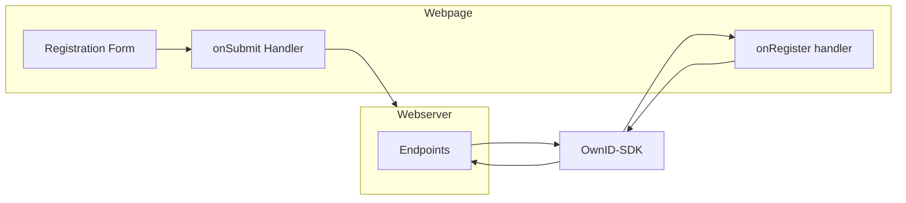
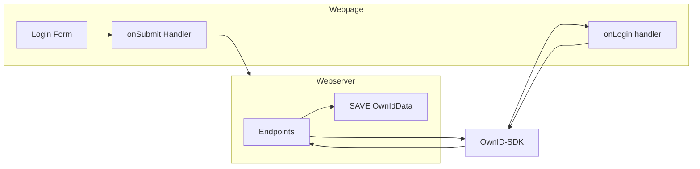

```mermaid
  flowchart LR
    subgraph Webpage
        direction TB
        top1[Registration Form] --> bottom1[onSubmit Handler]
        bottom3[onRegister handler]
    end
    subgraph Webserver
        direction TB
        top2[Endpoints] 
    end
    %% ^ These subgraphs are identical, except for the links to them:

    %% Link *to* subgraph1: subgraph1 direction is maintained
    bottom1 --> Webserver 
    %% Link *within* subgraph2:
    %% subgraph2 inherits the direction of the top-level graph (LR)
    OwnID-SDK ---> top2
    top2 ---> OwnID-SDK
    OwnID-SDK ---> bottom3
    bottom3 ---> OwnID-SDK
    
    

```
Figure 1. Registration components and dataflow

```mermaid
  flowchart LR
    subgraph Webpage
        direction TB
        top1[Login Form] --> bottom1[onSubmit Handler]
        bottom3[onLogin handler]
    end
    subgraph Webserver
        direction TB
        top2[Endpoints] --> bottom6[SAVE OwnIdData]
        
    end
    %% ^ These subgraphs are identical, except for the links to them:

    %% Link *to* subgraph1: subgraph1 direction is maintained
    bottom1 --> Webserver 
    %% Link *within* subgraph2:
    %% subgraph2 inherits the direction of the top-level graph (LR)
    OwnID-SDK ---> top2
    top2 ---> OwnID-SDK
    OwnID-SDK ---> bottom3
    bottom3 ---> OwnID-SDK
```
Figure 1. Login components and dataflow

